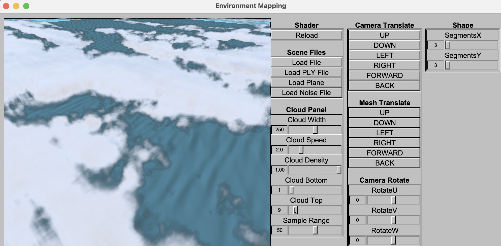

# Real-Time Ray Tracer in OpenGL 3.3

## Table of Contents
1. [Project Overview](#project-overview)
2. [Features](#features)
3. [Setup Instructions](#setup-instructions)
4. [Implementation Details](#implementation-details)
5. [Usage](#usage)
6. [Dependencies](#dependencies)
7. [Demo](#demo)
8. [Future Improvements](#future-improvements)
9. [License](#license)
10. [Acknowledgements](#acknowledgements)
11. [Third-Party Libraries](#third-party-libraries)

---

## Project Overview
This project implements a **real-time ray tracer** using **OpenGL 3.3**. The main highlights of the project include:
- **Ray marching volumetric clouds**
- **Triangular mesh rendering**
- **Dynamic ocean surface simulation**

---

## Features
- **Ray Marching Volumetric Clouds**:  
  Generates realistic clouds using ray marching and noise functions.  
- **Triangular Mesh Rendering**:  
  Supports dynamic rendering of triangular meshes with vertex and fragment shaders.  
- **Dynamic Ocean Surface Simulation**:  
  Real-time wave simulation for ocean surfaces using sinusoidal functions or FFT.  

---

## Setup Instructions
Follow the steps below to set up and run the project:

1. **Clone the Repository**:
   ```bash
   git clone https://github.com/XenonJ/Ray_Tracer_OpenGL.git
   cd Ray_Tracer_OpenGL
   ```

2. **Setup on MacOS**
    ``` bash
    brew install fltk glm glew
    ```

3. **Build**
    ``` bash
    make
    ```

4. **Run the Program**
    ``` bash
    ./demo
    ```
---

## Implementation Details
1. Ray Marching Volumetric Clouds
> + Generate 3D noise from the 2D-tiled map
> + Use adaptive stepsize for implementing the LOD
> + Add margin detect to naturalize the clouds near the edge of cloud box
> + Customize your own cloud with the interactive panel!!!

2. Triangular Mesh Rendering
> + calculating triangular mesh with xml scene graph, or read form ply file
> + convert triangular data into array and build KD Tree as a array
> + pass in the data as texture buffer and calculate intersection in shader

3. Dynamic Ocean Surface Simulation

4. Shaders and Render Pipeline

---

## Usage

1. Shader Management
+ Reload: Reloads the shader files for real-time updates.
2. Scene Files
+ Load File: Load a custom scene file.
+ Load PLY File: Import a triangular mesh in PLY format.
+ Load Plane: Loads a default plane mesh.
+ Load Noise File: Loads noise textures or data for volumetric clouds.
3. Cloud Panel

Adjust the cloud rendering properties:
+ Cloud Width: Adjusts the horizontal spread of the clouds.
+ Cloud Speed: Controls the speed of cloud movement.
+ Cloud Density: Controls how thick or sparse the clouds appear.
+ Cloud Bottom: Sets the lower altitude (height) of the clouds.
+ Cloud Top: Sets the upper altitude (height) of the clouds.
+ Sample Range: Controls the number of samples used for ray marching.

4. Camera Translate

Use these buttons to move the camera position:
+ UP/DOWN/LEFT/RIGHT: Moves the camera along the X and Y axes.
+ FORWARD/BACK: Moves the camera along the Z-axis.

5. Mesh Translate

Move the loaded mesh or plane along different axes:
+ UP/DOWN/LEFT/RIGHT: Moves the mesh horizontally or vertically.
+ FORWARD/BACK: Moves the mesh depth-wise.

6. Camera Rotate

Rotate the camera view using these sliders:
+ RotateU: Adjust rotation around the U-axis.
+ RotateV: Adjust rotation around the V-axis.
+ RotateW: Adjust rotation around the W-axis.

7. Shape Segments

Modify the mesh grid segmentation:
+ SegmentsX: Controls the number of horizontal segments.
+ SegmentsY: Controls the number of vertical segments.
---

## Dependencies

This project relies on the following libraries:
+ OpenGL 3.3: Core rendering API
+ GLFW: For window management and input handling
+ GLEW: OpenGL extension loader
+ GLM: Mathematics library for graphics

Ensure these dependencies are installed before building the project.

---

## Demo



---

## Future Improvements

---

## License
This project is licensed under the MIT License. See the LICENSE file for more details.

---
## Acknowledgements
+ GLFW: Window and input management.
+ GLEW: OpenGL extension handling.
+ GLM: Mathematics library for graphics.
+ Inspired by various real-time rendering techniques and ray marching methods.

---

## Third-Party Libraries

This project uses the following third-party software:

### TinyXML
- **License**: Custom permissive license (similar to zlib/libpng)
- **Original Author**: Yves Berquin
- **Modified By**: Tyge Løvset (April 7, 2005)
- **Source**: [TinyXML on SourceForge](https://www.sourceforge.net/projects/tinyxml)

This software is provided 'as-is', without any express or implied warranty. For full license terms, see the [TinyXML License](LICENSE_TINYXML.txt).

